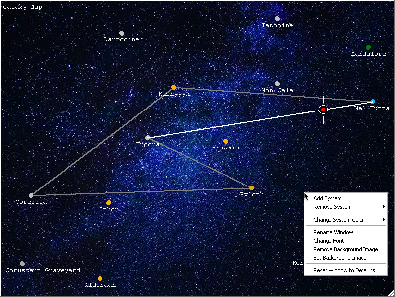
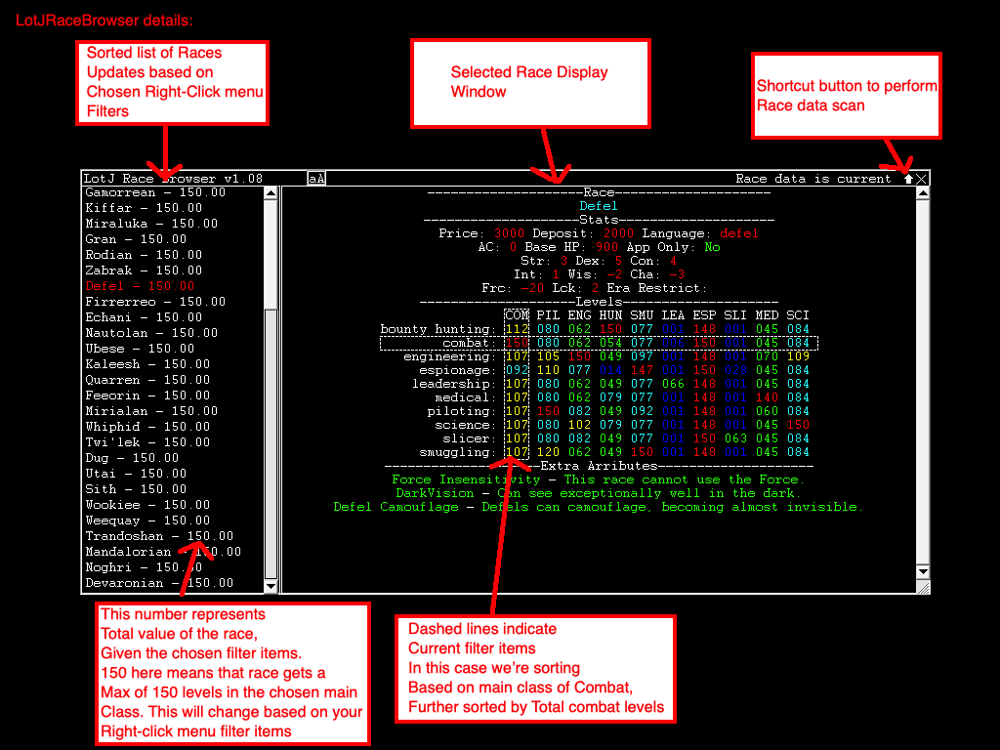

# Johnson's LotJPlugins

## Overview

This is a repository of plugins that I use with LotJ in an attempt to make certain 
 aspects of the game less tedious, easier to see visually, or to provide an 
 overall greater playing experience. These aren't intended to circumnavigate
 rules or allow cheating or exploiting in any fashion. Some of these plugins 
 are written entirely by me, some have been inspired by plugins on other MUDs 
 and some were created by other members of the LotJ community. I try to give 
 credit in each respective plugin where it is due, but if you see something 
 posted here that you had any part in helping create that hasn't been attributed 
 to you, I humbly apologize and ask that you inform me ASAP so I can remedy my 
 mistake.
  
These plugins are largely a work in progress and as a result often see many,
 many changes and differing versions. If something isn't working properly,
 first check to see if you have the most recent version, and if something still
 doesn't seem right, congratulations, you may have found a bug! Please let me
 know about it so I can fix it!
  
Questions, comments, complaints, suggestions, bug reports can be directed 
 via email to __LotJJohnson@gmail.com__, in game __@Johnson__, in the issues section
 of the GitHub repository, or on the LotJ forums.
 

## Features

### LotJStarMap.xml
<br>

#### v2.43
* Added support for a background image. This will default to looking for the image provided on GitHub called 'stars_800_600.png'
* Added larger indicator showing where the player is on the system map.
* Added cross-plugin support with LotJCargo to display cargo routes on the system map.
* Added automatic planet colors based on governing clan colors.

#### v2.28
* Added right click menu to give several new options including adding/removing systems, changing colors and fonts, or restoring defaults.
* Adjusted how distances are displayed when hovering a system, should be easier to read.

#### v2.15 
* Added resizing capability. Also added automatic settings and planet information saving.
* New command: `'showmap'` displays currently loaded planet settings without the need to scan every time.
* `'hypmap'` retains original scanning functionality
* Added support for ship coordinate display. Also added hyperjump route display.

### LotJRaceBrowser.xml
<br>

* Perform a race data scan using ```racescan```
* Display Race Browser window using ```raceshow```
* The plugin loads race information from the game and displays it in a window to make browsing and comparing races more convenient.
* Right click in the window to apply sorting filters. Races in the left side window are sorted based on the filter criteria.

## Installation

### GitHub https://github.com/Johnson336/LotJPlugins

##### __WARNING__ Do NOT right click files and choose "Save link as" as this will attempt to save the entire web page and will result in a distorted .xml file and will throw errors if you try to install it! You have been warned!
1. In the top right of the __<>Code__ tab, click the __Clone or download__ button, followed by __Download ZIP__ button to download the entire directory as a zip file.
2. Alternatively, click whichever plugin you wish to use and copy/paste the code into a text editor, saving each .xml file individually.   
3. Delete any previous versions of plugins you may be using to ensure no conflicts arise.
4. Open your plugin manager by pressing __ctrl+shift+p__ in MUSHclient, or click __File->Plugins__.
5. Click __Add__ and choose the .xml plugins you wish to use.
6. Click __Show Info__ on each plugin to see a brief description of what each does and information on the provided in-game help system for each.
7. Disconnect from the game world, then reconnect to allow changes to take effect.
   


## ChangeLog

### LotJRecord.xml

#### v1.00
* Released early version of this plugin. It allows you to record and replay game events while preserving time scale and original coloring, giving you exactly the experience of the situation recorded.
* As mentioned this is an early release so there aren't a lot of features, mainly the core mechanic of recording and replaying.
* More features may be added if there is interest in that happening.


### LotJMSDPHandler.xml

#### v0.55
* Reworked from the ground up how MSDP variables are parsed from the mud to store lists and arrays correctly.
* If you retrieve a variable in list or array form, it will be returned in a comma-separated list of key,value pairs.
 
#### v0.52
* Added LotJMSDPHelper.lua script file to hopefully ease usage of MSDP variables in community plugins.
    * To use MSDP variables in your plugin add the following code:
```
dofile(GetPluginInfo(GetPluginID(), 20) .. "LotJMSDPHelper.lua")
myVariable = getmsdp("VARIABLE NAME")
```

### LotJVisualSpace.xml

#### v0.95
* Added two new windows to the `'vsconfig'` menu:
    * Current ammo capacity meter
    * Ship location stats window
		
#### v0.93
* added redundancy to `getmsdp()` variable calls.

#### v0.90
* 3D coordinate window works, check the option in the `'vsconfig'` window to enable displays ship position as well as relative local space bodies.
* Scan local space with `'radar'`

#### v0.82
* Experimenting with 3D coordinate transforms and attempting to display localized space bodies represented in a 2D window.

### LotJFlight.xml
* Added squadron home ship labeling. Saves the ship that launched a fighter and displays that information when the fighter is seen via look, proximity, radar, or fleetradar in the format: 

```
TIE-Fighter 'TwentySeven'  Prox: 0->[MotherShip]
```
   
### LotJMemory.xml 

#### v1.0
* Released this plugin to save description information of people you look at. Each character has a unique memory which must be loaded by typing 'score' when you log in. Memory can be viewed in short format via 'memcheck' or in long format via 'memcheck full'. You can search for a specific description or dub/greet via 'memcheck <name>'.
* Example: 
```
'memcheck human'
You last saw Hummale04 on 04/02/13(7 days ago). They were A strong, good looking white skinned Human male.
```

### LotJCalc.xml

#### v1.06
* Added local space highlighting for easy in-sector calculating. Also added variable hook for StarMap to access.
  
### LotJLocate.xml

#### v1.0
* First release of this plugin, created at the request of Zeromus.
  
### Smaug_prog_parse.xml

#### v1.0
* Added automatic indenting with customizable indent size.

### LotJBuildShip.xml

#### v1.34
* Added ability for buildadd command to accept a comma-delimiter for adding multiple items with one command.
  
### LotJStudy.xml
#### v1.04
* Adjusted command parsing to be more flexible in how it handles input.
* Added ability for studyadd command to accept a comma-delimiter for adding multiple items with one command.
